# CQRS + Event Sourcing Architecture

This document describes the architecture of the Chirp application, which implements Command Query Responsibility Segregation (CQRS) and Event Sourcing patterns.

## Table of Contents
1. [Overall Architecture](#overall-architecture)
2. [Command Flow (Write Side)](#command-flow-write-side)
3. [Query Flow (Read Side)](#query-flow-read-side)
4. [Event Sourcing](#event-sourcing)
5. [Event Projection & Timeline Optimization](#event-projection--timeline-optimization)
6. [Layer Architecture](#layer-architecture)
7. [Specific Flow Examples](#specific-flow-examples)

---

## Overall Architecture

The application follows CQRS principles, separating the write side (commands) from the read side (queries).

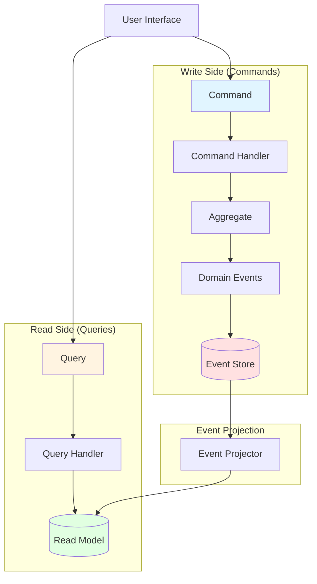

**Key Principles:**
- **Write Side**: Commands modify state by creating domain events
- **Read Side**: Queries read from optimized read models
- **Event Store**: Single source of truth for all state changes
- **Eventual Consistency**: Read models are eventually consistent with the event store

---

## Command Flow (Write Side)

Commands represent user intentions to modify state. They flow through the system creating events that are persisted.

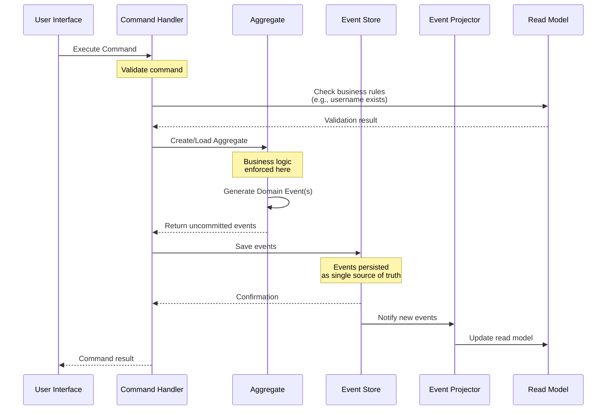

**Flow Steps:**
1. User interface sends a command to the handler
2. Handler validates the command (may check read model)
3. Handler creates or loads the aggregate from events
4. Aggregate enforces business rules and generates domain events
5. Handler saves events to the event store
6. Event projector updates the read model
7. Handler returns result to UI

---

## Query Flow (Read Side)

Queries read from optimized read models without touching the event store or aggregates.

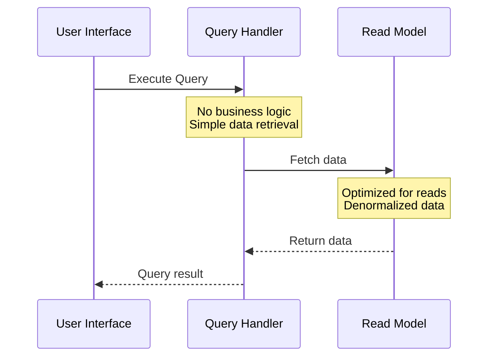

**Key Points:**
- Queries are simple and fast
- No business logic on the read side
- Read models are denormalized for optimal query performance
- Read models may be eventually consistent

---

## Event Sourcing

Instead of storing current state, the system stores all events that led to the current state.

### Aggregate Reconstruction from Events

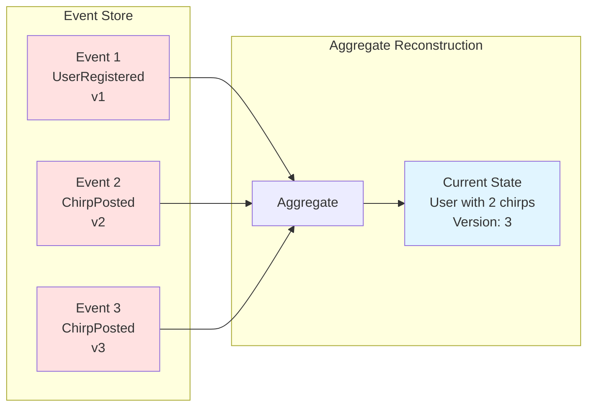

### Event Store Structure

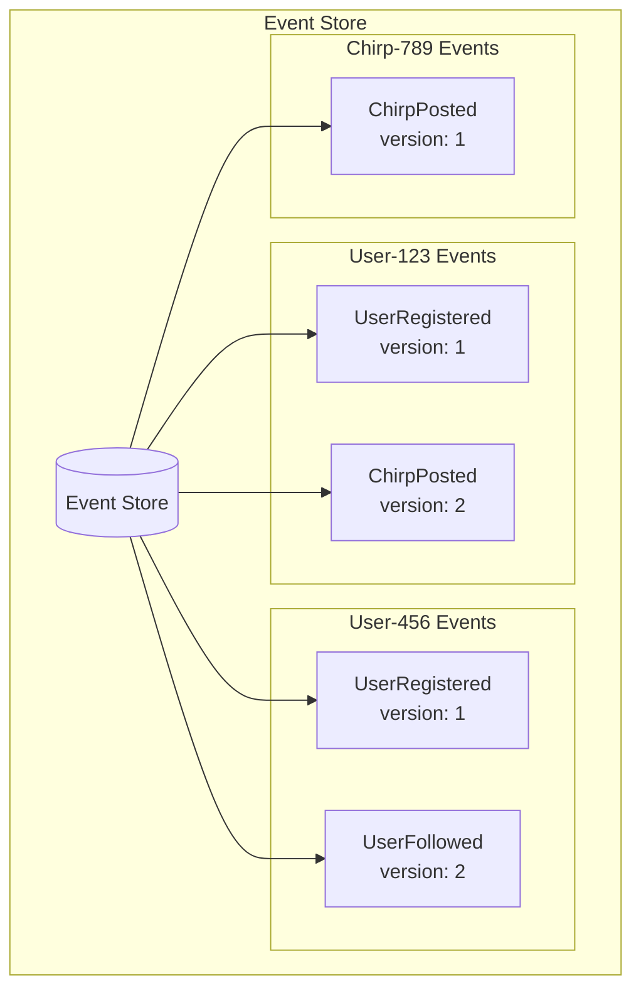

**Benefits:**
- Complete audit trail of all changes
- Ability to reconstruct state at any point in time
- Can rebuild read models by replaying events
- Temporal queries (what was the state at time X?)

---

## Event Projection & Timeline Optimization

The system uses different strategies for projecting events to read models based on user type (celebrity vs regular user).

### Event Projection Flow

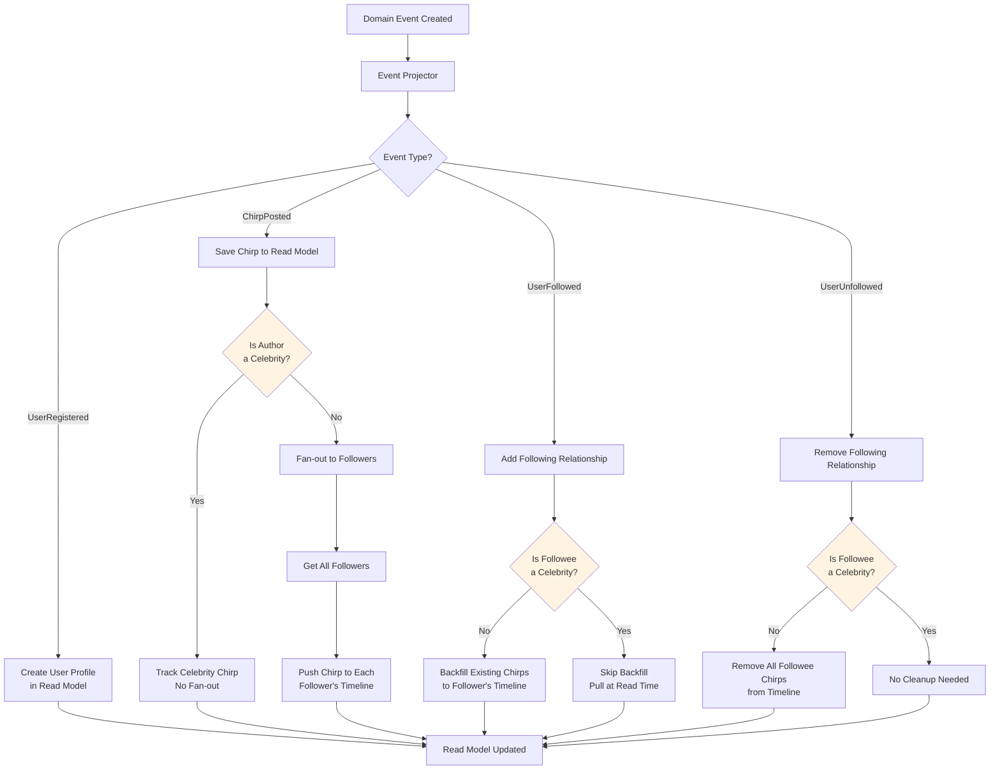

### Timeline Strategies

#### Regular Users (Write-time Fan-out)

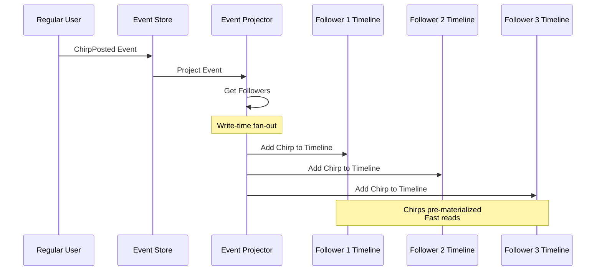

**Advantages:**
- Fast reads (timeline is pre-computed)
- Simple query logic

**Trade-offs:**
- Higher write cost
- More storage (duplicated chirp references)

#### Celebrity Users (Read-time Pull)

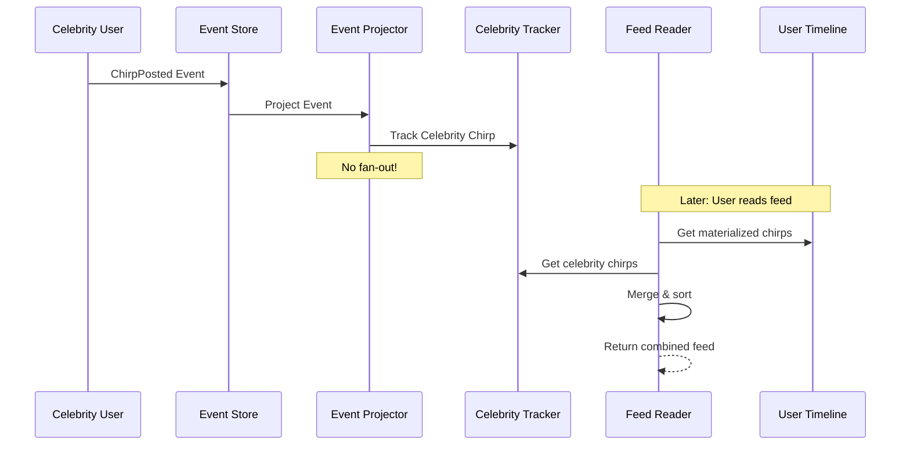

**Advantages:**
- Scalable for high-follower-count users
- Lower write cost
- Less storage

**Trade-offs:**
- Slightly slower reads (pull + merge)

### Follow/Unfollow Timeline Management

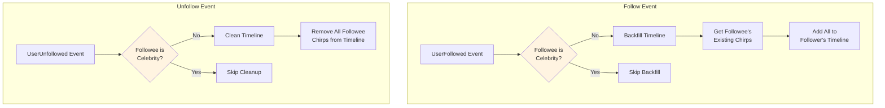

---

## Layer Architecture

The application follows a layered architecture pattern.

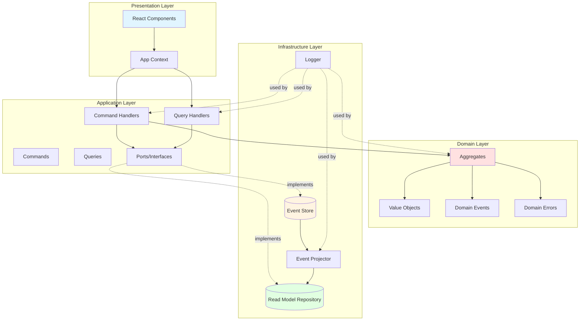

**Layer Responsibilities:**

1. **Presentation Layer**
   - User interface components
   - State management
   - User interactions

2. **Application Layer**
   - Coordinates application flow
   - Commands and queries
   - Handlers (application logic)
   - Ports (interfaces for infrastructure)

3. **Domain Layer**
   - Business logic and rules
   - Aggregates (entities with identity)
   - Value objects (immutable values)
   - Domain events
   - Domain errors

4. **Infrastructure Layer**
   - Event store implementation
   - Read model repository implementation
   - Event projection
   - Logging

---

## Specific Flow Examples

### Example 1: User Registration

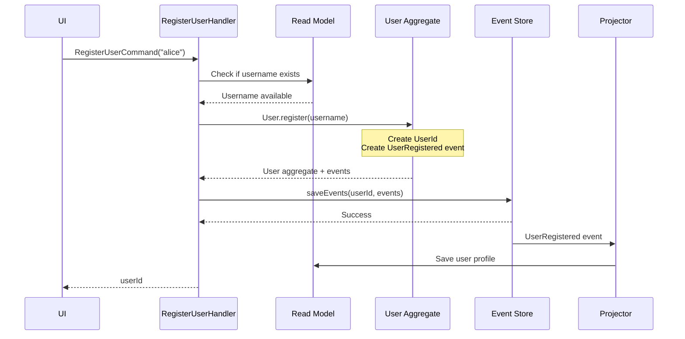

### Example 2: Posting a Chirp (Regular User)

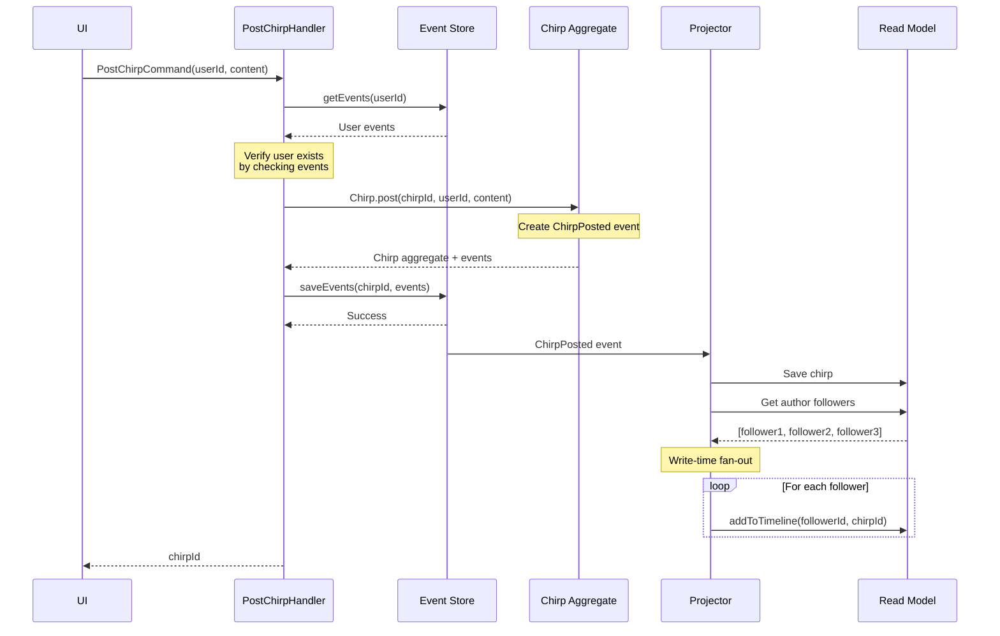

### Example 3: Following a User (with Timeline Backfill)

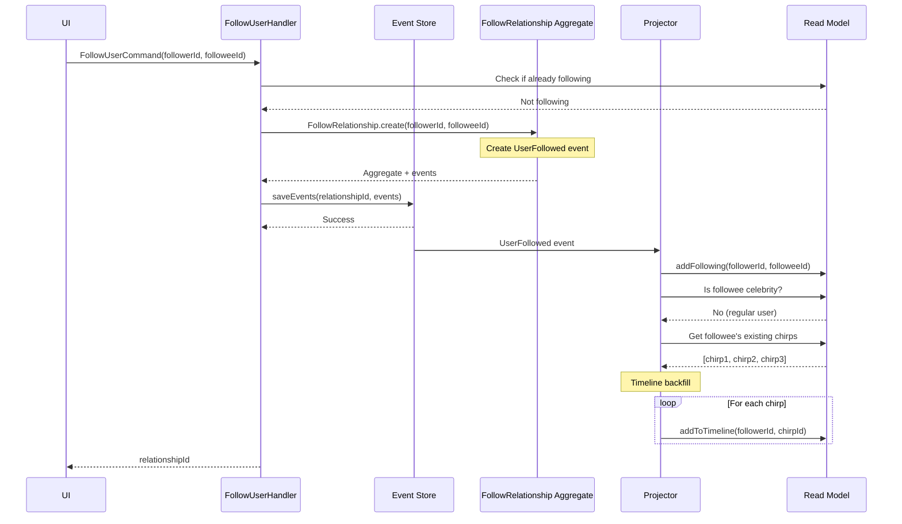

### Example 4: Reading User Feed

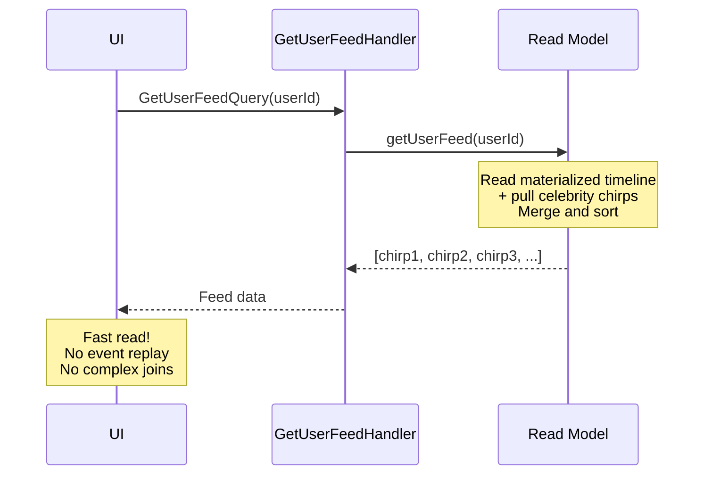

---

## Key Patterns and Concepts

### 1. Eventual Consistency
- Write side completes immediately after saving events
- Read models are updated asynchronously
- UI may show slightly stale data (acceptable trade-off)

### 2. Aggregate Boundaries
- Each aggregate is responsible for its own consistency
- User aggregate: manages user registration
- Chirp aggregate: manages chirp posting
- FollowRelationship aggregate: manages follow/unfollow

### 3. Domain Events as First-Class Citizens
- Events are the source of truth
- Events enable temporal queries
- Events enable rebuilding read models
- Events provide complete audit trail

### 4. Read Model Optimization
- Denormalized for fast reads
- Separate models for different use cases
- Celebrity optimization pattern
- Timeline pre-materialization

### 5. Command-Query Separation
- Commands: Mutate state, return minimal data (usually IDs)
- Queries: Read state, never mutate
- Different models for writes vs reads
- Optimized independently

---

## Benefits of This Architecture

1. **Scalability**
   - Read and write sides scale independently
   - Celebrity optimization prevents write bottlenecks
   - Read models optimized for specific queries

2. **Auditability**
   - Complete history of all changes
   - Can answer "what happened?" questions
   - Supports compliance and debugging

3. **Flexibility**
   - Can add new read models without changing write side
   - Can rebuild read models from events
   - Can create new projections for new features

4. **Business Logic Isolation**
   - Domain logic encapsulated in aggregates
   - Clean separation of concerns
   - Testable business rules

5. **Performance**
   - Reads are fast (pre-computed data)
   - Writes are focused (just append events)
   - Can optimize each side independently

---

## Trade-offs and Considerations

1. **Complexity**
   - More moving parts than CRUD
   - Eventual consistency requires careful UX design
   - Requires understanding of both patterns

2. **Storage**
   - Events are never deleted (by design)
   - Read models duplicate data
   - Need to plan for data growth

3. **Learning Curve**
   - Team needs to understand CQRS/ES patterns
   - Different from traditional CRUD thinking
   - Requires discipline to maintain boundaries

4. **Debugging**
   - More complex to trace through system
   - Need good logging and monitoring
   - Event versioning considerations

---

## Conclusion

This architecture provides a robust foundation for building scalable, auditable applications. The separation of concerns between commands and queries, combined with event sourcing, enables the system to handle complex domain logic while maintaining high performance for both reads and writes.
