# Hexagonal Architecture (Ports and Adapters)

This document explains how the Chirp application implements Hexagonal Architecture, also known as the Ports and Adapters pattern.

## Table of Contents
1. [Introduction](#introduction)
2. [The Hexagonal Structure](#the-hexagonal-structure)
3. [Ports (Interfaces)](#ports-interfaces)
4. [Adapters (Implementations)](#adapters-implementations)
5. [Dependency Inversion Principle](#dependency-inversion-principle)
6. [Request Flow Through the Hexagon](#request-flow-through-the-hexagon)
7. [Benefits and Advantages](#benefits-and-advantages)
8. [Swappable Adapters](#swappable-adapters)

---

## Introduction

**Hexagonal Architecture** (coined by Alistair Cockburn) is an architectural pattern that aims to create loosely coupled application components that can be easily connected to their software environment through ports and adapters. This architecture separates the core business logic from external concerns.

### Key Principles

1. **Domain at the center**: Business logic is isolated from external concerns
2. **Ports**: Define interfaces (contracts) for communication
3. **Adapters**: Implement the interfaces to connect to external systems
4. **Dependency direction**: All dependencies point inward toward the domain

---

## The Hexagonal Structure

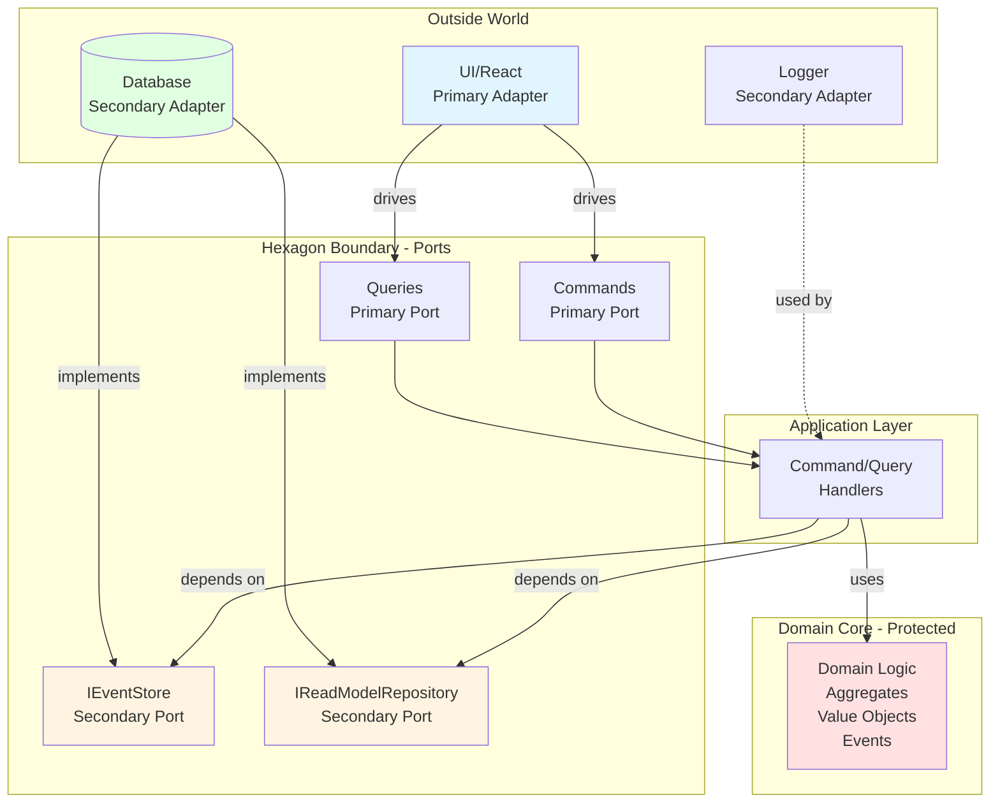

### Layers Explained

- **Domain Core** (center): Pure business logic with zero dependencies
- **Application Layer**: Orchestrates domain logic, depends only on ports
- **Ports**: Interfaces defining how to interact with external systems
- **Adapters**: Concrete implementations of ports, connecting to actual technologies

---

## Ports (Interfaces)

Ports are interfaces that define contracts. They represent what the application needs from the outside world (secondary ports) or what the outside world can do to the application (primary ports).

### Port Types

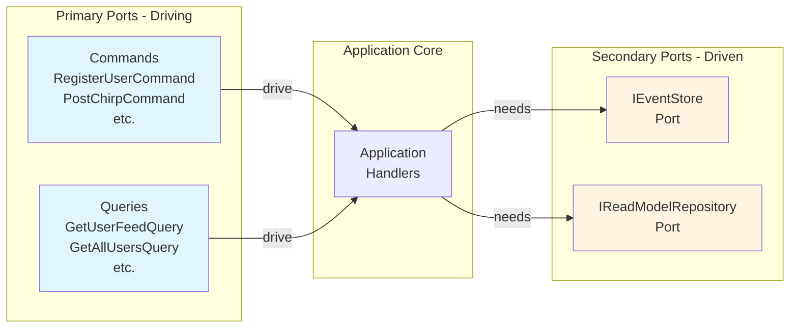

### Secondary Port: IEventStore

Located at: `src/application/ports/IEventStore.ts`

```typescript
export interface IEventStore {
  saveEvents(aggregateId: string, events: DomainEvent[]): Promise<void>;
  getEvents(aggregateId: string): Promise<DomainEvent[]>;
  getAllEvents(): Promise<DomainEvent[]>;
}
```

**Purpose**: Defines how to persist and retrieve domain events
**Why it's a port**: Application doesn't care *how* events are stored (memory, PostgreSQL, MongoDB, etc.)

### Secondary Port: IReadModelRepository

Located at: `src/application/ports/IReadModelRepository.ts`

```typescript
export interface IReadModelRepository {
  // User operations
  saveUserProfile(profile: UserProfileReadModel): Promise<void>;
  getUserProfile(userId: string): Promise<UserProfileReadModel | null>;
  // ... many more methods
  
  // Feed operations
  getUserFeed(userId: string): Promise<ChirpReadModel[]>;
  
  // Timeline operations
  addToTimeline(userId: string, chirpId: string): Promise<void>;
  // ... etc
}
```

**Purpose**: Defines how to persist and query read models
**Why it's a port**: Application doesn't care about the underlying storage technology

---

## Adapters (Implementations)

Adapters are concrete implementations of ports. They connect the application to specific technologies.

### Adapter Structure

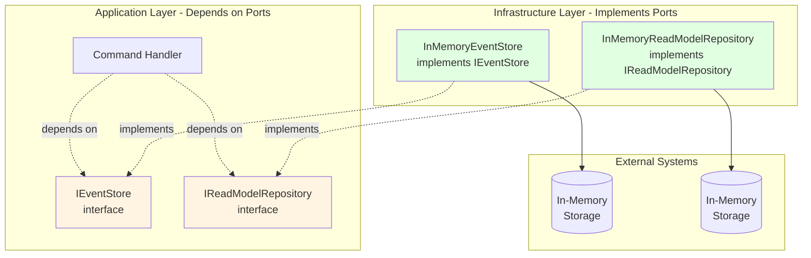

### Primary Adapter: React UI

Located at: `src/presentation/`

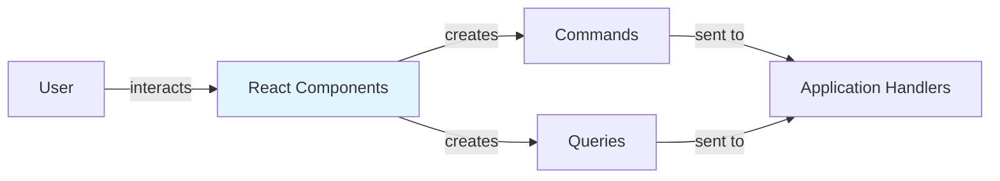

**Purpose**: Translates user actions into commands and queries
**Technology**: React, but could be replaced with Vue, Angular, CLI, etc.

### Secondary Adapter: InMemoryEventStore

Located at: `src/infrastructure/event-store/InMemoryEventStore.ts`

```mermaid
graph TB
    PORT[IEventStore<br/>Port/Interface]
    
    ADAPTER[InMemoryEventStore<br/>Adapter]
    
    STORAGE[(Map<string, DomainEvent[]><br/>In-Memory Storage)]
    
    ADAPTER -.implements.-> PORT
    ADAPTER -->|uses| STORAGE
    
    style PORT fill:#fff4e1
    style ADAPTER fill:#e1ffe1
```

**Current Implementation**: Uses JavaScript Map for in-memory storage
**Could be replaced with**: PostgresEventStore, MongoEventStore, EventStoreDB adapter, etc.

### Secondary Adapter: InMemoryReadModelRepository

Located at: `src/infrastructure/repositories/InMemoryReadModelRepository.ts`

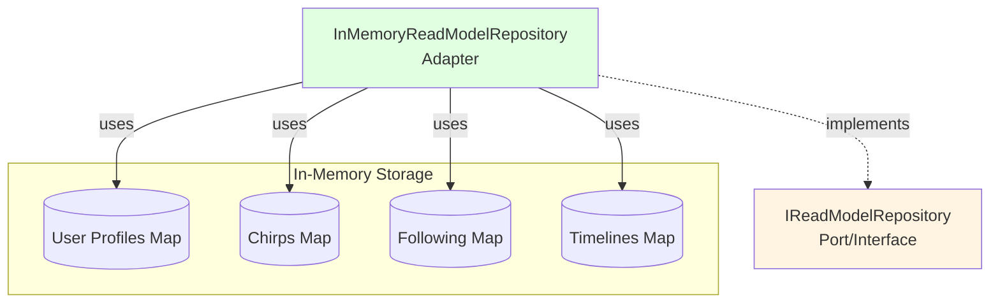

**Current Implementation**: Uses JavaScript Maps for in-memory storage
**Could be replaced with**: PostgresReadModelRepository, RedisReadModelRepository, etc.

### Secondary Adapter: EventProjector

Located at: `src/infrastructure/projections/EventProjector.ts`

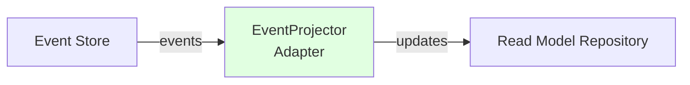

**Purpose**: Projects domain events into read models
**Why it's an adapter**: Bridges between event store and read model repository

---

## Dependency Inversion Principle

The key to Hexagonal Architecture is that **dependencies point inward**.

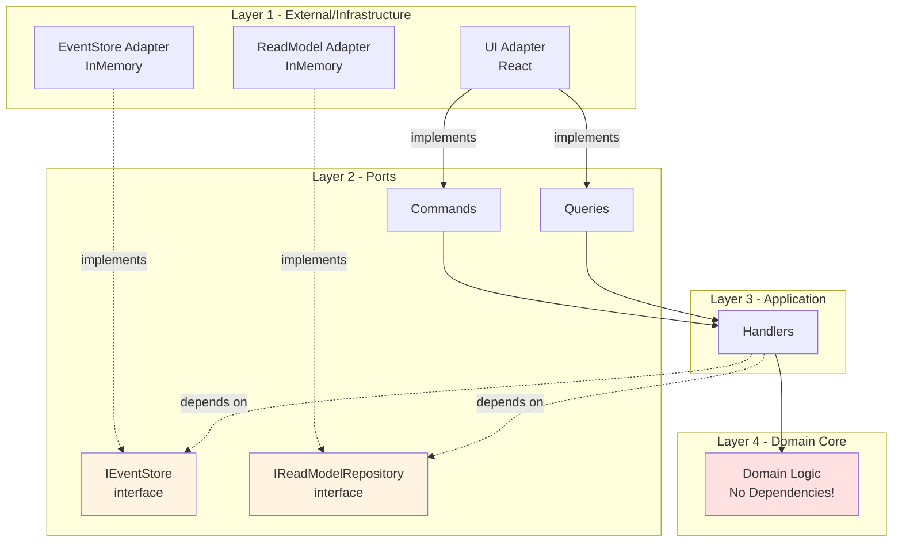

### Dependency Rules

1. **Domain Layer**: Has ZERO dependencies - pure business logic
2. **Application Layer**: Depends only on Domain and Port interfaces
3. **Infrastructure Layer**: Depends on Ports (implements them)
4. **Never**: Domain → Application, Domain → Infrastructure

### Example: Handler Dependencies

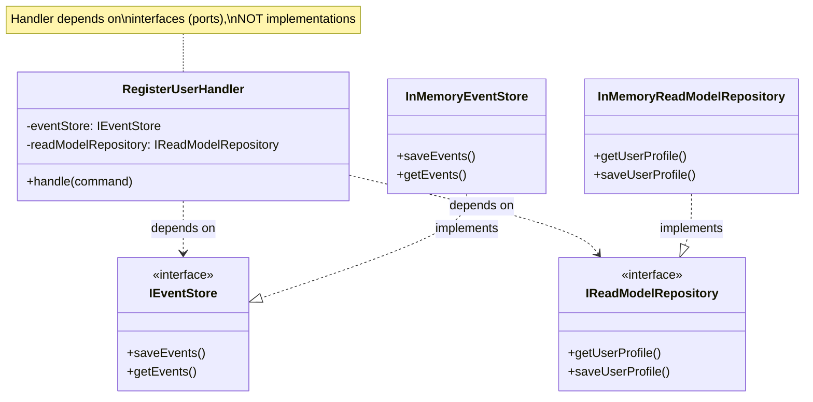

**Key Point**: `RegisterUserHandler` knows about `IEventStore` and `IReadModelRepository` interfaces, but has no knowledge of `InMemoryEventStore` or `InMemoryReadModelRepository` concrete classes.

---

## Request Flow Through the Hexagon

### Command Flow (Write Operation)

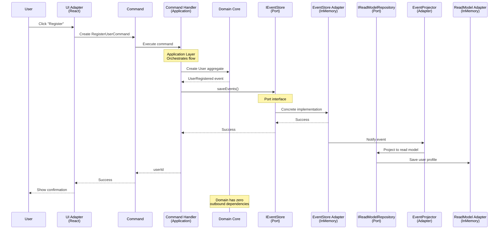

**Key Observations:**

1. **UI Adapter** (primary) drives the application by creating commands
2. **Application** orchestrates but depends only on port interfaces
3. **Domain** is completely isolated - no knowledge of adapters
4. **Infrastructure Adapters** (secondary) implement the port interfaces
5. **Dependency direction**: Always points inward

### Query Flow (Read Operation)

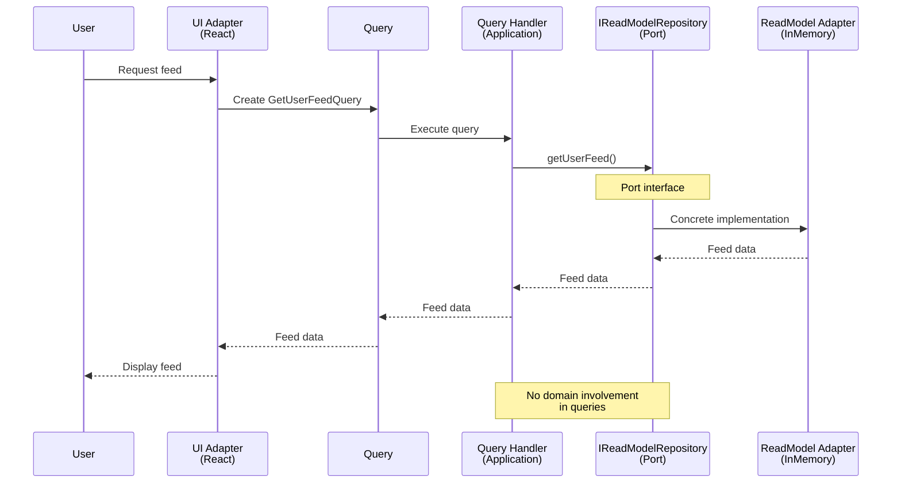

---

## Benefits and Advantages

### 1. Testability

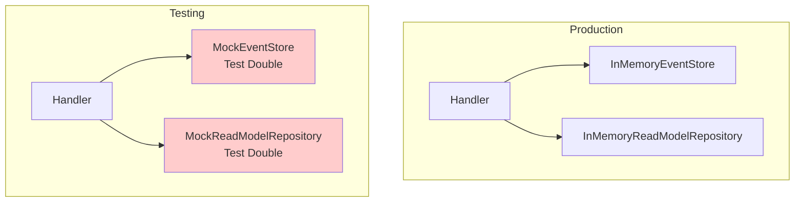

**Benefit**: Easy to test handlers by injecting mock adapters

```typescript
// Example: Testing with mocks
const mockEventStore: IEventStore = {
  saveEvents: jest.fn(),
  getEvents: jest.fn(),
  getAllEvents: jest.fn(),
};

const handler = new RegisterUserHandler(
  mockEventStore,
  mockReadModelRepository
);

// Test handler without real infrastructure
```

### 2. Swappable Technology

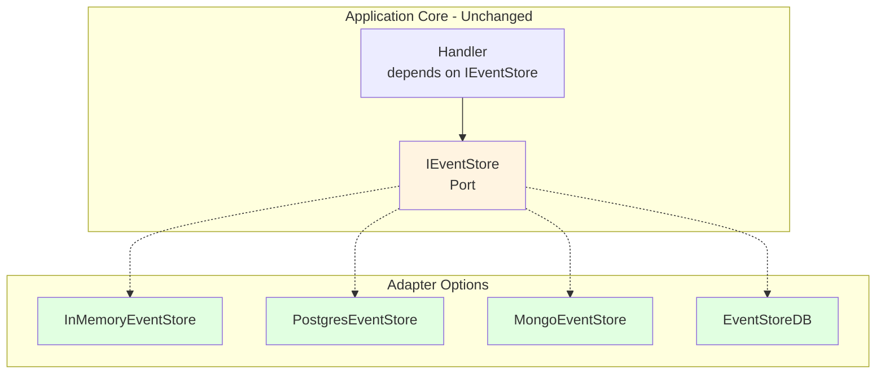

**Benefit**: Can swap implementations without changing application code

### 3. Technology Independence

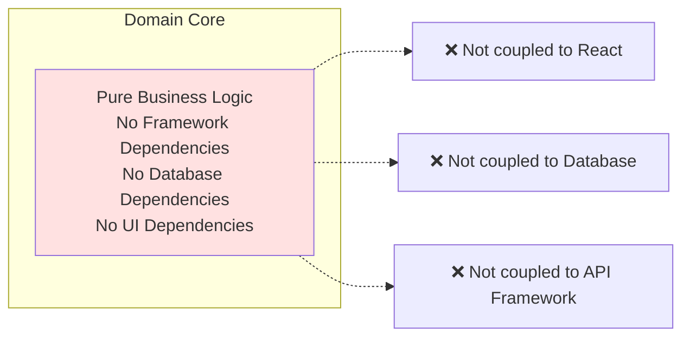

**Benefit**: Domain logic survives technology changes

### 4. Clear Boundaries

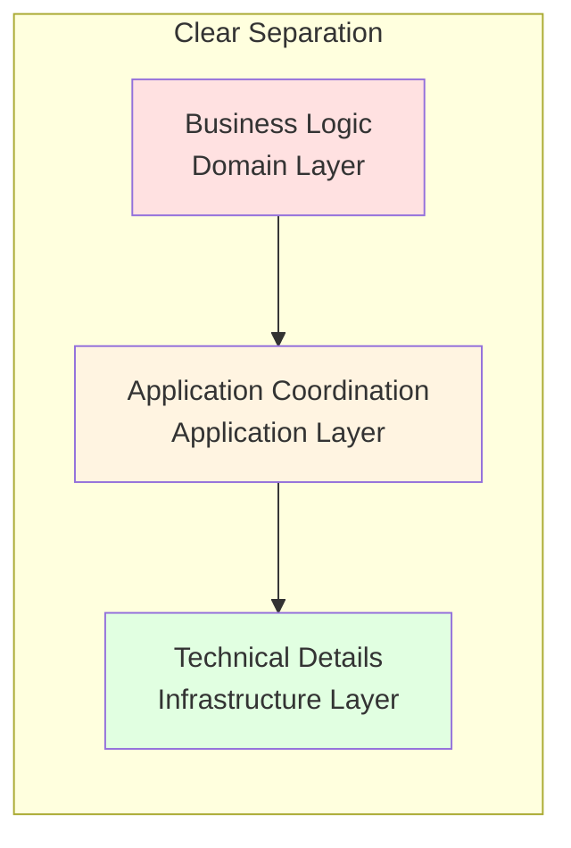

**Benefit**: Each layer has a single, well-defined responsibility

### 5. Parallel Development

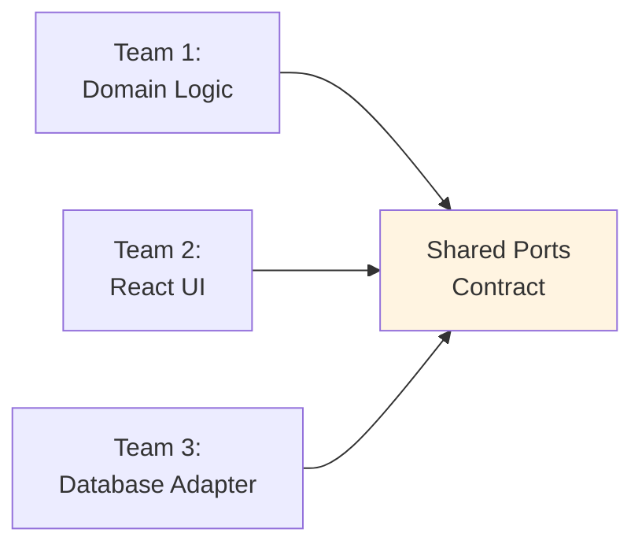

**Benefit**: Teams can work in parallel as long as they agree on port contracts

---

## Swappable Adapters

One of the main benefits is the ability to swap adapters without changing the core application.

### Example: Replacing Event Store

#### Current Setup

```typescript
// src/config/container.ts (conceptual)
const eventStore: IEventStore = new InMemoryEventStore();
```

#### Could Be Replaced With

```typescript
// PostgreSQL adapter
const eventStore: IEventStore = new PostgresEventStore(config);

// EventStoreDB adapter  
const eventStore: IEventStore = new EventStoreDBAdapter(config);

// File-based adapter
const eventStore: IEventStore = new FileSystemEventStore(config);
```

### Migration Strategy

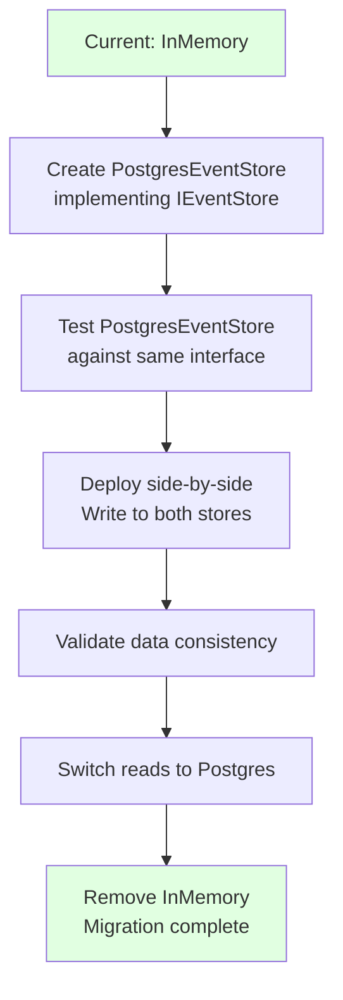

**Key Point**: Application handlers never change - they still use `IEventStore` interface

### Example: Multiple UI Adapters

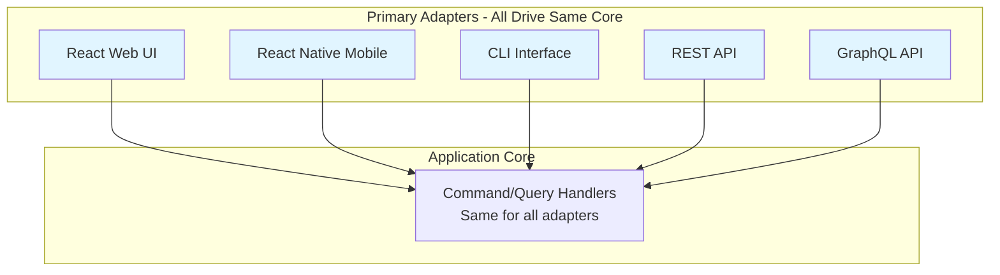

**Benefit**: Can support multiple interfaces without duplicating business logic

---

## Real-World Adapter Replacements

### Scenario 1: Production Scaling

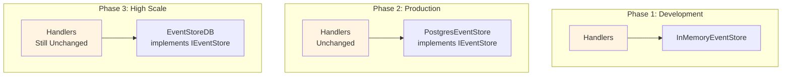

### Scenario 2: Read Model Optimization

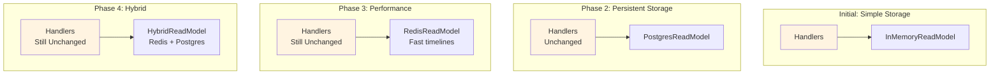

---

## Comparison: With vs Without Hexagonal Architecture

### Without Hexagonal Architecture (Tightly Coupled)

```mermaid
graph TB
    UI[UI] --> HANDLER[Handler]
    HANDLER --> DB[(Concrete Database)]
    HANDLER --> UI
    
    Note1[Handler knows about<br/>specific database technology]
    Note2[Can't swap database<br/>without rewriting handler]
    Note3[Hard to test<br/>requires real database]
    
    style DB fill:#ffcccc
```

### With Hexagonal Architecture (Loosely Coupled)

```mermaid
graph TB
    UI[UI Adapter] --> PORT1[Command Port]
    PORT1 --> HANDLER[Handler]
    HANDLER --> PORT2[IEventStore Port]
    PORT2 --> ADAPTER[(Adapter)]
    
    Note1[Handler depends on<br/>abstraction not concrete]
    Note2[Can swap adapter<br/>without touching handler]
    Note3[Easy to test<br/>use mock adapter]
    
    style PORT2 fill:#fff4e1
    style ADAPTER fill:#e1ffe1
```

---

## Complete System View

```mermaid
graph TB
    subgraph "Primary Side - Drivers"
        USER[User]
        UI[React UI<br/>Primary Adapter]
    end
    
    subgraph "Hexagon Core"
        subgraph "Ports - Left Side"
            COMMANDS[Commands<br/>Primary Ports]
            QUERIES[Queries<br/>Primary Ports]
        end
        
        subgraph "Application Layer"
            CMD_H[Command Handlers]
            QRY_H[Query Handlers]
        end
        
        subgraph "Domain Layer"
            AGG[Aggregates]
            VO[Value Objects]
            EVENTS[Domain Events]
        end
        
        subgraph "Ports - Right Side"
            IES[IEventStore<br/>Secondary Port]
            IRM[IReadModelRepository<br/>Secondary Port]
        end
    end
    
    subgraph "Secondary Side - Driven"
        ES[InMemoryEventStore<br/>Secondary Adapter]
        RM[InMemoryReadModelRepository<br/>Secondary Adapter]
        PROJ[EventProjector<br/>Secondary Adapter]
        LOG[Logger<br/>Secondary Adapter]
    end
    
    USER --> UI
    UI --> COMMANDS
    UI --> QUERIES
    
    COMMANDS --> CMD_H
    QUERIES --> QRY_H
    
    CMD_H --> AGG
    AGG --> VO
    AGG --> EVENTS
    
    CMD_H -.depends on.-> IES
    CMD_H -.depends on.-> IRM
    QRY_H -.depends on.-> IRM
    
    ES -.implements.-> IES
    RM -.implements.-> IRM
    
    ES --> PROJ
    PROJ --> RM
    
    LOG -.used by.-> CMD_H
    LOG -.used by.-> QRY_H
    LOG -.used by.-> PROJ
    
    style AGG fill:#ffe1e1
    style UI fill:#e1f5ff
    style IES fill:#fff4e1
    style IRM fill:#fff4e1
    style ES fill:#e1ffe1
    style RM fill:#e1ffe1
```

---

## Key Takeaways

1. **Ports define contracts**: Interfaces that abstract away implementation details

2. **Adapters implement contracts**: Concrete implementations that can be swapped

3. **Dependencies point inward**: Outer layers depend on inner layers, never the reverse

4. **Domain is protected**: Core business logic has zero dependencies on frameworks or technologies

5. **Testability**: Easy to test by injecting mock adapters

6. **Flexibility**: Can swap technologies without changing business logic

7. **Technology independence**: Domain logic survives technology changes

8. **Clear boundaries**: Each layer has a single, well-defined responsibility

---

## Conclusion

Hexagonal Architecture provides a clean separation between business logic and technical concerns. By using ports (interfaces) and adapters (implementations), the application core remains independent of external technologies, frameworks, and delivery mechanisms.

This architecture enables:
- **Easy testing** through dependency injection
- **Technology migration** without rewriting business logic
- **Multiple interfaces** (web, mobile, API) to the same core
- **Parallel development** as long as teams agree on port contracts
- **Long-term maintainability** by isolating what changes from what stays stable

The Chirp application demonstrates these principles by keeping the domain pure, defining clear port interfaces, and implementing adapters that can be easily replaced as needs evolve.
